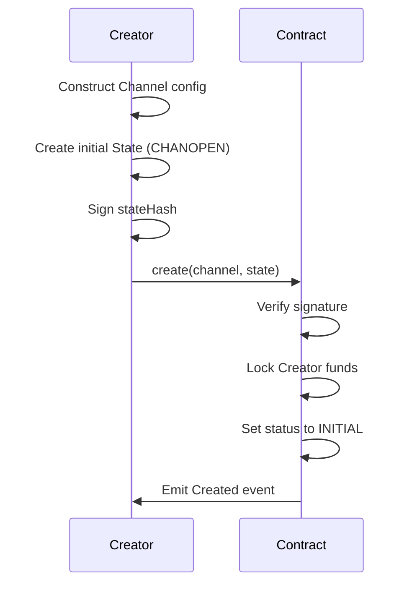
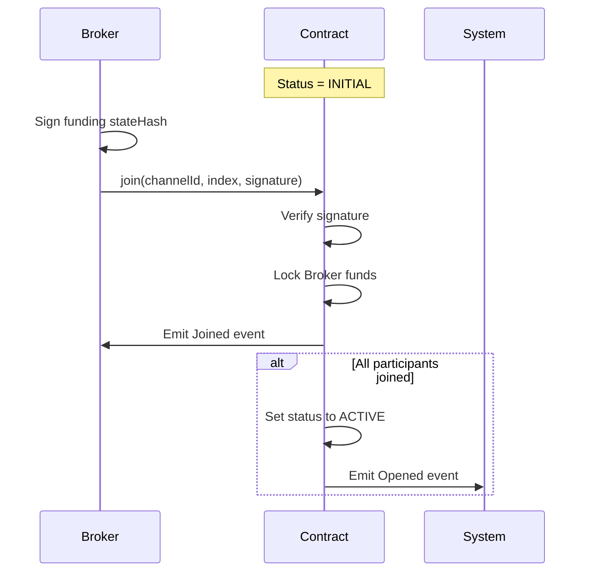
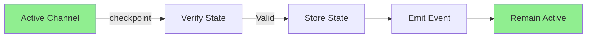
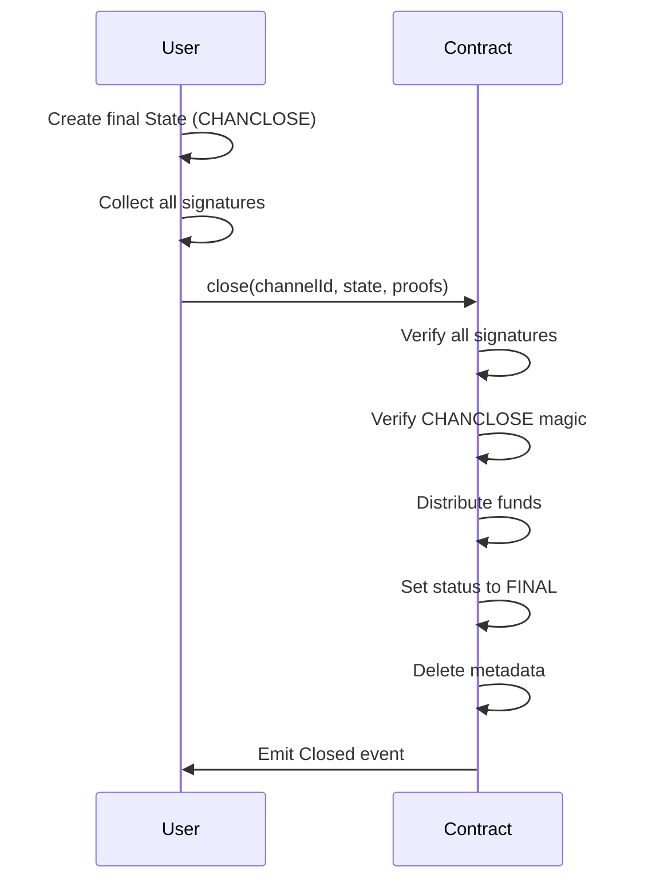
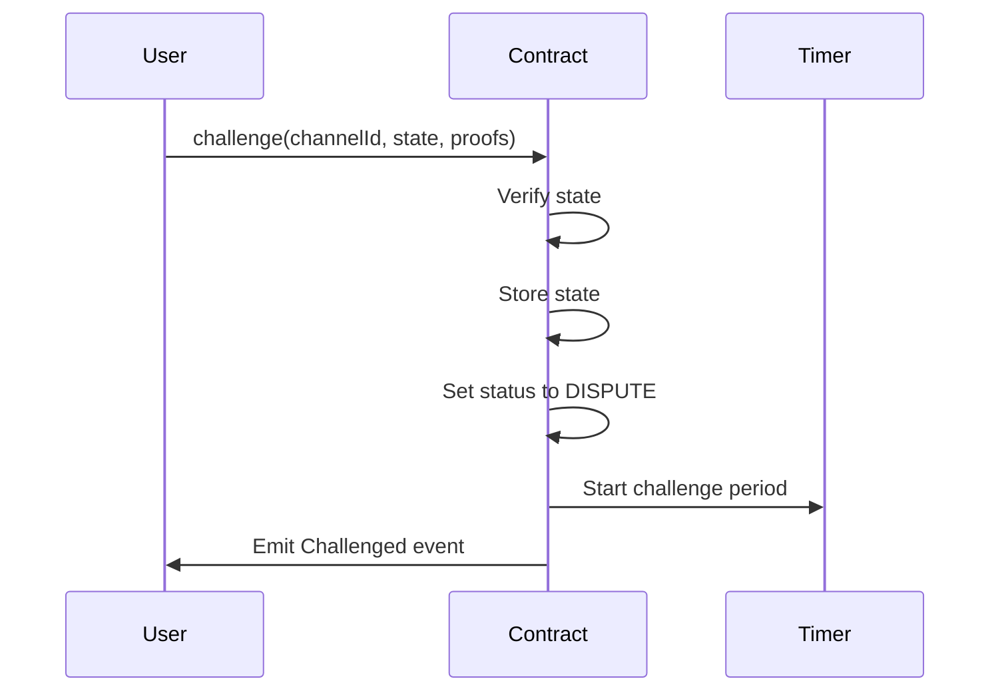
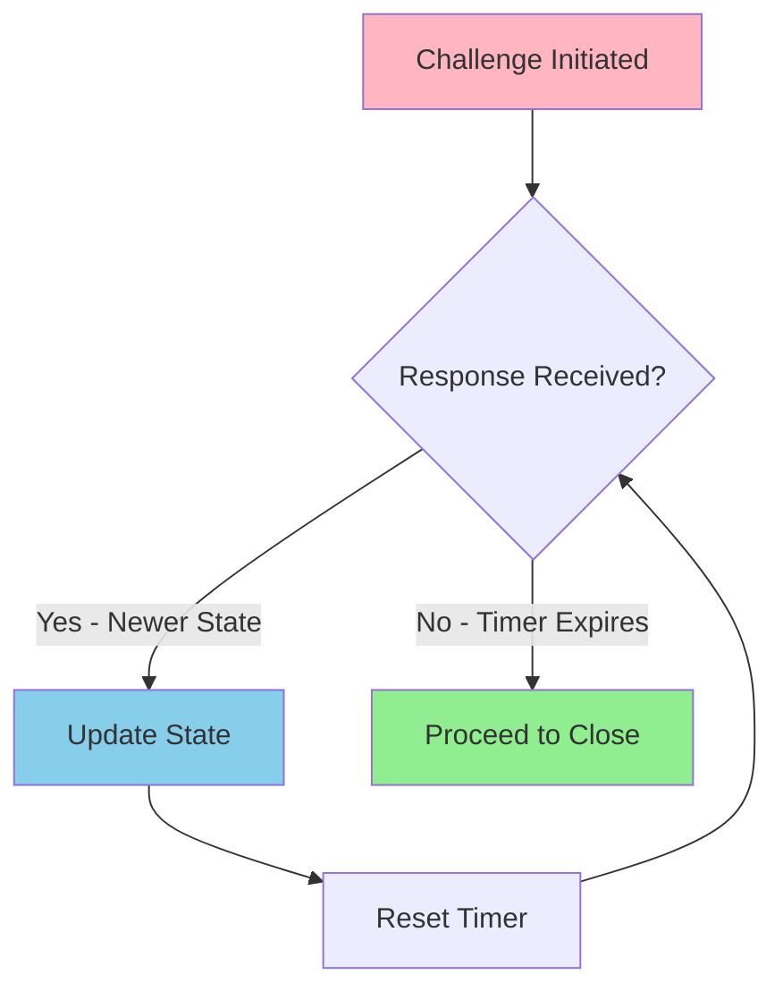
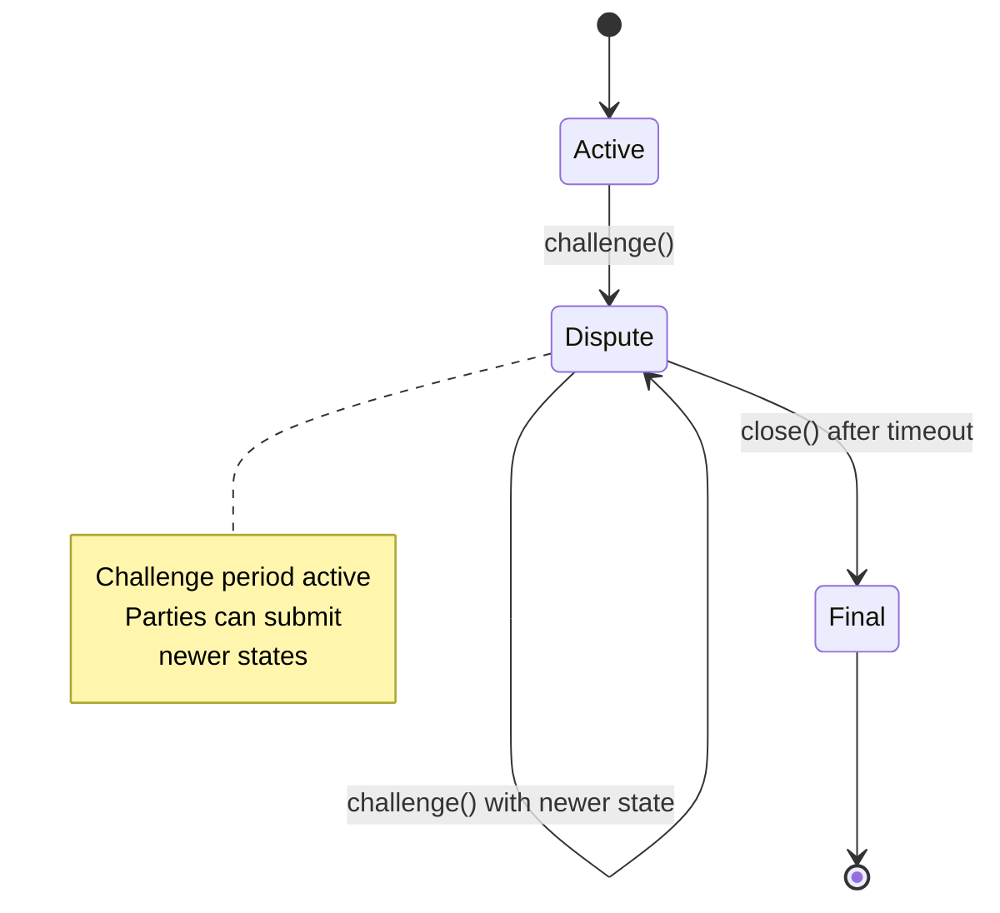
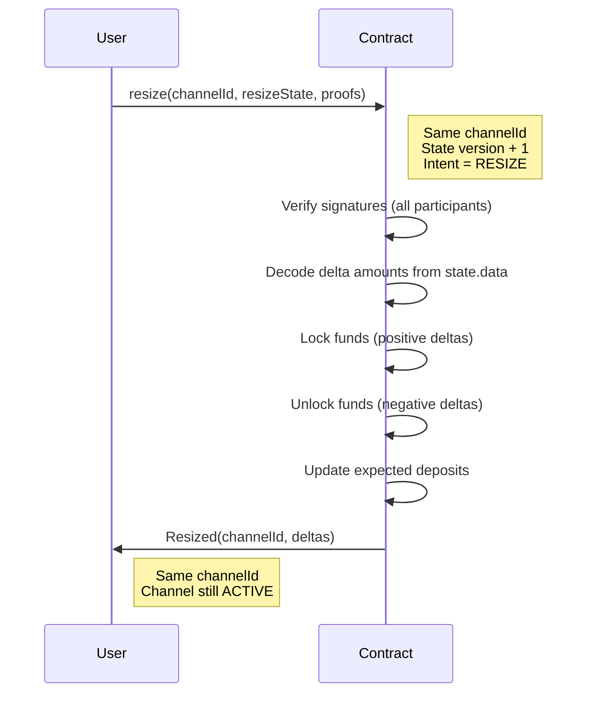
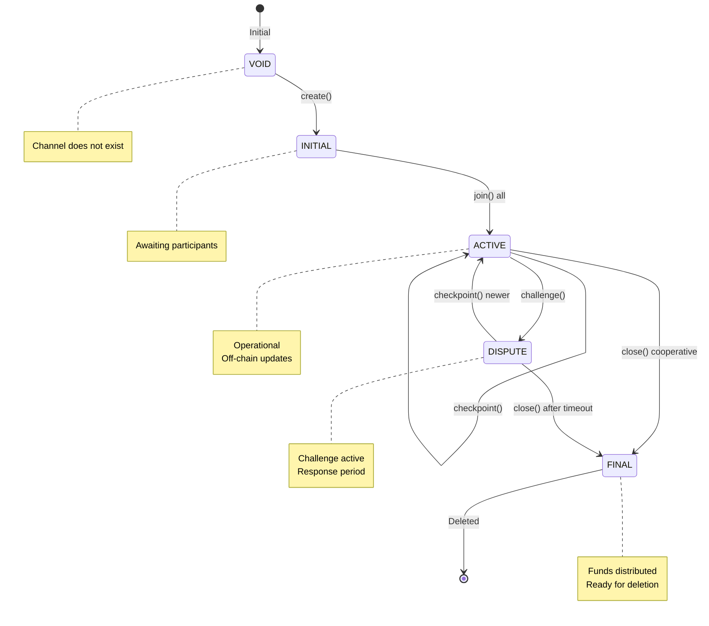

import Tooltip from '@site/src/components/Tooltip';

# Channel Lifecycle

## Creation Phase

**Purpose**: Initiate a new <Tooltip content="A secure communication pathway between participants that locks funds in an on-chain smart contract while enabling off-chain state updates.">channel</Tooltip> with specified <Tooltip content="An entity (identified by a wallet address) that is part of a channel.">participants</Tooltip> and initial funding.

**Process**:

1. The <Tooltip content="Most often a light client willing to fund a ledger account with the Broker.">Creator</Tooltip> MUST:
   - Construct a Channel configuration with <Tooltip content="An entity (identified by a wallet address) that is part of a channel.">participants</Tooltip>, <Tooltip content="A smart contract that validates state transitions according to application-specific rules.">adjudicator</Tooltip>, challenge period, and nonce
   - Prepare an initial <Tooltip content="A snapshot of the channel at a point in time, including fund allocations and application-specific data.">State</Tooltip> where `state.data` contains the magic number `CHANOPEN` (7877)
   - Define expected token deposits for all participants in `state.allocations`
   - Compute the funding <Tooltip content="A cryptographic hash of a channel state, used for signature verification.">stateHash</Tooltip> of this initial state
   - Include Creator's signature in `state.sigs` at position 0
   - Call the `create` function with the channel configuration and initial signed state

2. The contract MUST:
   - Verify the Creator's signature on the funding stateHash
   - Verify Creator has sufficient balance to fund their allocation
   - Lock the Creator's funds according to the allocation
   - Set the channel status to `INITIAL`
   - Emit a `Created` event with channelId, channel configuration, and expected deposits

:::info Important
The caller (EOA or contract) is usually different from the <Tooltip content="An entity (identified by a wallet address) that is part of a channel.">participant</Tooltip> address. Participants are derived addresses generated by the owner, similar to <Tooltip content="A temporary cryptographic key delegated by a user's main wallet that provides a flexible way for the user to manage security of their funds by giving specific permissions and allowances for specific apps.">session keys</Tooltip>, to enable high-frequency state signing without exposing the main wallet.
:::

## Joining Phase

:::info Two Channel Opening Flows
There are two ways to open a channel:
1. **Modern/Recommended**: Provide ALL signatures in `create()` → channel immediately ACTIVE (see [Architecture](../architecture#channel-opening))
2. **Legacy/Manual**: Provide only creator's signature in `create()` → status INITIAL → separate `join()` calls → ACTIVE

This section documents flow #2. Most implementations use flow #1.
:::

**Purpose**: Allow other participants to join and fund the channel (when using separate join flow).

**Process**:

1. Each non-<Tooltip content="Most often a light client willing to fund a ledger account with the Broker.">Creator</Tooltip> participant MUST:
   - Verify the <Tooltip content="A unique identifier for a channel, computed as the hash of the channel configuration.">channelId</Tooltip> and expected allocations
   - Sign the same funding <Tooltip content="A cryptographic hash of a channel state, used for signature verification.">stateHash</Tooltip> (containing magic number `CHANOPEN`)
   - Call the `join` function with channelId, their participant index, and signature

2. The contract MUST:
   - Verify the participant's signature against the funding stateHash
   - Confirm the signer matches the expected participant at the given index
   - Lock the participant's funds according to the allocation
   - Track the actual deposit in the channel metadata
   - Emit a `Joined` event with channelId and participant index

3. When all participants have joined, the contract MUST:
   - Verify that all expected deposits are fulfilled
   - Set the channel status to `ACTIVE`
   - Emit an `Opened` event with channelId

:::success Channel Activation
The channel becomes operational only when ALL participants have successfully joined and funded their allocations.
:::

## Active Phase

**Purpose**: Enable off-chain <Tooltip content="A snapshot of the channel at a point in time, including fund allocations and application-specific data.">state</Tooltip> updates while <Tooltip content="A secure communication pathway between participants that locks funds in an on-chain smart contract while enabling off-chain state updates.">channel</Tooltip> is operational.

### Off-Chain Updates

<Tooltip content="An entity (identified by an address) that is part of a channel.">Participants</Tooltip> MUST:
- Exchange and sign state updates off-chain via the <Tooltip content="The off-chain communication protocol.">Nitro RPC</Tooltip> protocol
- Maintain a record of the latest valid state
- Follow <Tooltip content="A smart contract that validates state transitions according to application-specific rules.">adjudicator</Tooltip>-specific rules for signature requirements
- Use application-specific data in the `state.data` field

Each new state MUST:
- Contain updated allocations reflecting the new distribution of assets
- Be signed by the necessary participants according to application rules
- Comply with the validation rules of the channel's adjudicator

The on-chain contract remains unchanged during the active phase unless participants choose to checkpoint a state.

:::tip Off-Chain Efficiency
During the active phase, state updates occur entirely off-chain with zero gas costs and sub-second latency.
:::

## Checkpointing

**Purpose**: Record a state on-chain without entering dispute mode.

**Process**:

1. Any participant MAY:
   - Call the `checkpoint` function with a valid state and required proofs

2. The contract MUST:
   - Verify the submitted state via the adjudicator
   - If valid and more recent than any previously checkpointed state, store it
   - Emit a `Checkpointed` event with channelId

**Benefits**:
- Creates an on-chain record of current state
- Shortens the effective history that could be challenged
- Does not start a challenge period
- Channel remains in `ACTIVE` status

:::note Optional Operation
Checkpointing is optional but recommended for long-lived channels or after significant value transfers.
:::

## Closure - Cooperative

**Purpose**: Close <Tooltip content="A secure communication pathway between participants that locks funds in an on-chain smart contract while enabling off-chain state updates.">channel</Tooltip> when all <Tooltip content="An entity (identified by a wallet address) that is part of a channel.">participants</Tooltip> agree on final <Tooltip content="A snapshot of the channel at a point in time, including fund allocations and application-specific data.">state</Tooltip>.

**Process**:

1. Any participant MAY:
   - Prepare a final State where `state.data` contains magic number `CHANCLOSE` (7879)
   - Collect signatures from all participants on this final state
   - Call the `close` function with <Tooltip content="A unique identifier for a channel, computed as the hash of the channel configuration.">channelId</Tooltip>, final state, and any required proofs

2. The contract MUST:
   - Verify all participant signatures on the closing <Tooltip content="A cryptographic hash of a channel state, used for signature verification.">stateHash</Tooltip>
   - Verify the state contains the `CHANCLOSE` magic number
   - Distribute funds according to the final state's allocations
   - Set the channel status to `FINAL`
   - Delete the channel metadata
   - Emit a `Closed` event

:::success Preferred Method
**This is the preferred closure method as it is fast and gas-efficient.** It requires only one transaction and completes immediately without a challenge period.
:::

## Closure - Challenge-Response

**Purpose**: Handle closure when participants disagree or one party is unresponsive.

### Challenge Process

1. To initiate a challenge, a participant MAY:
   - Call the `challenge` function with their latest valid state and required proofs

2. The contract MUST:
   - Verify the submitted state via the adjudicator
   - If valid, store the state and start the challenge period
   - Set a challenge expiration timestamp (current time + challenge duration)
   - Set the channel status to `DISPUTE`
   - Emit a `Challenged` event with channelId and expiration time

### Response Process

During the challenge period, any participant MAY:
- Submit a more recent valid state by calling `checkpoint()`
- If the new state is valid and more recent (as determined by the adjudicator or IComparable interface), the contract MUST update the stored state and reset the challenge period

### Resolution

After the challenge period expires, any participant MAY:
- Call `close` to distribute funds according to the last valid challenged state

The contract MUST:
- Verify the challenge period has elapsed
- Distribute funds according to the challenged state's allocations
- Set channel status to `FINAL`
- Delete the channel metadata
- Emit a `Closed` event

:::warning Key Principle
The challenge mechanism gives parties time to prove they have a newer state. If no one responds with a newer state, the challenged state is assumed correct.
:::

**Complete Challenge-Response Flow**:

## Resize Protocol

**Purpose**: Adjust <Tooltip content="A secure communication pathway between participants that locks funds in an on-chain smart contract while enabling off-chain state updates.">channel</Tooltip> capacity by locking or unlocking funds **without closing the channel**.

**Process**:

1. Any <Tooltip content="An entity (identified by a wallet address) that is part of a channel.">participant</Tooltip> MAY:
   - Call the `resize` function with:
     - The <Tooltip content="A unique identifier for a channel, computed as the hash of the channel configuration.">channelId</Tooltip> (remains unchanged)
     - A candidate <Tooltip content="A snapshot of the channel at a point in time, including fund allocations and application-specific data.">State</Tooltip> with:
       - `intent` = `StateIntent.RESIZE` (2)
       - `version` = precedingState.version + 1
       - `data` = ABI-encoded `int256[]` containing delta amounts (positive for deposit, negative for withdrawal)
       - `allocations` = final Allocation[] after resize (absolute amounts)
       - Signatures from **ALL participants** (consensus required)
     - An array of proof States supporting the candidate

2. The contract MUST:
   - Verify the <Tooltip content="A secure communication pathway between participants that locks funds in an on-chain smart contract while enabling off-chain state updates.">channel</Tooltip> is in ACTIVE status
   - Verify all participants have signed the resize state
   - Decode delta amounts from `candidate.data`
   - Validate adjudicator approves the preceding state
   - For positive deltas: Lock additional funds from custody account
   - For negative deltas: Unlock funds back to custody account
   - Update expected deposits to match new allocations
   - Emit `Resized(channelId, deltaAllocations)` event

3. The <Tooltip content="A secure communication pathway between participants that locks funds in an on-chain smart contract while enabling off-chain state updates.">channel</Tooltip>:
   - **channelId remains UNCHANGED** (same channel persists)
   - Status remains **ACTIVE** throughout
   - Version increments by 1
   - No new channel is created

**Use Cases**:
- Increasing channel capacity (positive delta: adding funds)
- Decreasing channel capacity (negative delta: removing funds)
- Adjusting allocations while maintaining channel continuity

:::tip In-Place Update
The resize operation updates the channel **in place**. The channelId stays the same, and the channel remains ACTIVE throughout. This differs from closing and reopening, which would create a new channel.
:::
## State Transition Summary

The complete channel lifecycle state machine:

**Valid Transitions**:

| From | To | Trigger | Requirements |
|------|----|---------|--------------| 
| VOID | INITIAL | `create()` | Creator signature, sufficient balance |
| INITIAL | ACTIVE | `join()` | All participants joined and funded |
| ACTIVE | ACTIVE | `checkpoint()` | Valid newer state |
| ACTIVE | DISPUTE | `challenge()` | Valid state with proofs |
| ACTIVE | FINAL | `close()` | All signatures, CHANCLOSE magic |
| DISPUTE | ACTIVE | `checkpoint()` | Valid newer state |
| DISPUTE | FINAL | `close()` | Challenge period expired |
| FINAL | VOID | Automatic | Metadata deleted |

:::note Channel Deletion
When a channel reaches FINAL status, the channel metadata is deleted from the chain and funds are distributed according to the final state allocations. 
:::

