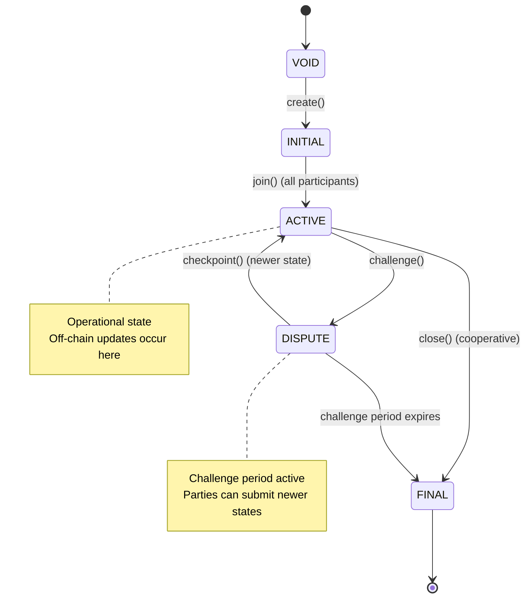
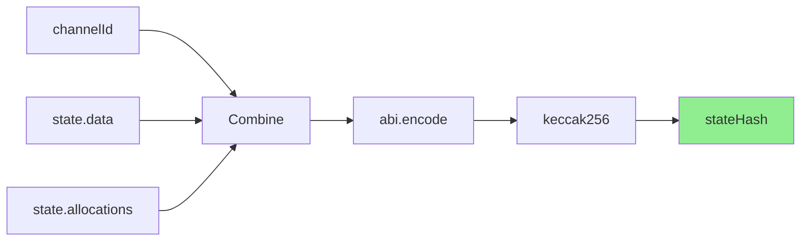

import Tooltip from '@site/src/components/Tooltip';

# Data Structures

## Channel

Represents the configuration of a <Tooltip content="A secure communication pathway between participants that locks funds in an on-chain smart contract while enabling off-chain state updates.">state channel</Tooltip>.

```solidity
struct Channel {
    address[] participants;  // List of participants in the channel
    address adjudicator;     // Contract that validates state transitions
    uint64 challenge;        // Duration in seconds for dispute resolution
    uint64 nonce;           // Unique identifier for the channel
}
```

**Fields**:

- `participants`: An ordered array of <Tooltip content="An entity (identified by an address) that is part of a channel.">participant</Tooltip> addresses. Index 0 is typically the <Tooltip content="Most often a light client willing to fund a ledger account with the Broker.">Creator</Tooltip>, index 1 is the <Tooltip content="An RPC message broker (also called Clear Node or Yellow Node) responsible for managing the off-chain protocol and providing services to clients.">Broker</Tooltip>.
- `adjudicator`: Address of the <Tooltip content="A smart contract that validates state transitions according to application-specific rules.">adjudicator</Tooltip> contract responsible for validating state transitions.
- `challenge`: Challenge period duration in seconds. Determines how long a party has to respond to a challenge.
- `nonce`: A unique number that, combined with other fields, creates a unique <Tooltip content="A unique identifier for a channel, computed as the hash of the channel configuration.">channel identifier</Tooltip>.

:::info Participant Addresses
The caller (EOA or contract) is usually different from the <Tooltip content="An entity (identified by an address) that is part of a channel.">participant</Tooltip> address. Participants are derived addresses generated by the owner, similar to <Tooltip content="A temporary cryptographic key delegated by a user's main wallet to enable gasless transaction signing.">session keys</Tooltip>, to enable high-frequency state signing without exposing the main wallet.
:::

## State

Represents a snapshot of <Tooltip content="A secure communication pathway between participants that locks funds in an on-chain smart contract while enabling off-chain state updates.">channel</Tooltip> state at a point in time.

```solidity
struct State {
    bytes data;               // Application-specific data
    Allocation[] allocations; // Asset allocation for each participant
    Signature[] sigs;         // Signatures from participants
}
```

**Fields**:

- `data`: Application-specific data. For funding states, contains magic numbers (CHANOPEN = 7877, CHANCLOSE = 7879).
- `allocations`: Array of allocations defining how funds are distributed.
- `sigs`: Array of signatures, one per <Tooltip content="An entity (identified by an address) that is part of a channel.">participant</Tooltip>. Order corresponds to participants array in Channel.

## Allocation

Specifies how a particular amount of a token should be allocated.

```solidity
struct Allocation {
    address destination;  // Recipient of funds
    address token;        // ERC-20 token address
    uint256 amount;       // Token amount in smallest unit
}
```

**Fields**:

- `destination`: Address that will receive the funds when channel closes.
- `token`: Contract address of the ERC-20 token (or zero address for native currency).
- `amount`: Amount in the token's smallest unit (wei for ETH, considering decimals for ERC-20).

## Signature

ECDSA signature components.

```solidity
struct Signature {
    uint8 v;      // Recovery identifier
    bytes32 r;    // First 32 bytes of signature
    bytes32 s;    // Second 32 bytes of signature
}
```

Signatures follow the secp256k1 curve standard used in Ethereum. The protocol is chain-agnostic and signatures are computed over the raw stateHash without EIP-191 prefix.

:::caution Chain-Agnostic Signatures
Signatures in Nitrolite are computed over raw stateHash without EIP-191 prefix, ensuring chain-agnostic compatibility.
:::

## Amount

Represents a quantity of a specific token.

```solidity
struct Amount {
    address token;    // ERC-20 token address
    uint256 amount;   // Token amount
}
```

## Channel Status

Enum representing the lifecycle stage of a channel.

```solidity
enum Status {
    VOID,      // Channel does not exist
    INITIAL,   // Creation in progress, awaiting all participants
    ACTIVE,    // Fully funded and operational
    DISPUTE,   // Challenge period active
    FINAL      // Ready to be closed and deleted
}
```

**State Transitions**:



## Protocol Constants

```solidity
constant uint256 CREATOR = 0;      // Creator's participant index
constant uint256 BROKER = 1;       // Broker's participant index
constant uint32 CHANOPEN = 7877;   // Magic number for funding state
constant uint32 CHANCLOSE = 7879;  // Magic number for closing state
```

:::tip Magic Numbers
- **CHANOPEN (7877 / 0x1EC5)**: Signals an initial funding state during channel creation
- **CHANCLOSE (7879 / 0x1EC7)**: Signals a final closing state for cooperative closure
:::

## Identifier Computation

### Channel Identifier

The <Tooltip content="A unique identifier for a channel, computed as the hash of the channel configuration.">channelId</Tooltip> MUST be computed as:

```javascript
channelId = keccak256(
    abi.encode(
        channel.participants,
        channel.adjudicator,
        channel.challenge,
        channel.nonce
    )
)
```

This creates a deterministic, unique identifier for each <Tooltip content="A secure communication pathway between participants that locks funds in an on-chain smart contract while enabling off-chain state updates.">channel</Tooltip>. <Tooltip content="Off-chain channels built on top of payment channels, also called App Sessions.">Virtual Ledger Channels</Tooltip> use the same computation method.

:::note Deterministic IDs
Channel IDs are deterministically computed from the channel configuration, ensuring the same configuration always produces the same identifier.
:::

### State Hash

The <Tooltip content="A cryptographic hash of a channel state, used for signature verification.">stateHash</Tooltip> MUST be computed as:

```javascript
stateHash = keccak256(
    abi.encode(
        channelId,
        state.data,
        state.allocations
    )
)
```

Signatures are generated over this <Tooltip content="A cryptographic hash of a channel state, used for signature verification.">stateHash</Tooltip>. The stateHash is signed without EIP-191 prefix as the protocol is intended to be chain-agnostic.

**Computation Process**:



:::warning Signature Verification
All state updates MUST be verified by checking signatures against the computed stateHash before accepting them on-chain.
:::

