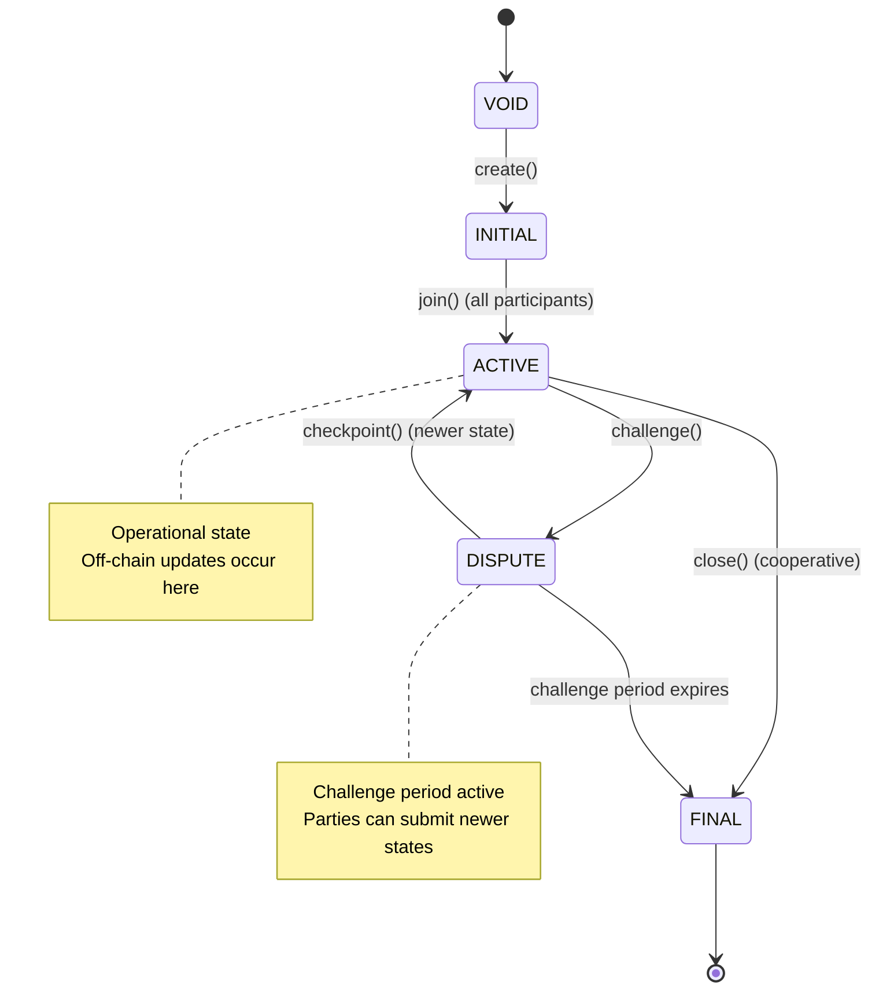
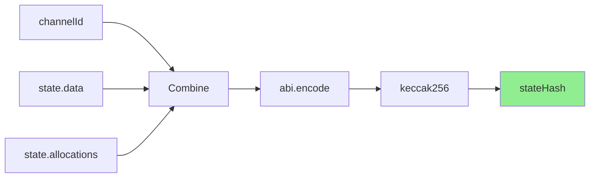

import Tooltip from '@site/src/components/Tooltip';
import { tooltipDefinitions } from '@site/src/constants/tooltipDefinitions';

# Data Structures

## Channel

Represents the configuration of a <Tooltip content={tooltipDefinitions.channel}>state channel</Tooltip>.

```solidity
struct Channel {
    address[] participants;  // List of participants in the channel
    address adjudicator;     // Contract that validates state transitions
    uint64 challenge;        // Duration in seconds for dispute resolution
    uint64 nonce;           // Unique identifier for the channel
}
```

**Fields**:

- `participants`: An ordered array of <Tooltip content={tooltipDefinitions.participant}>participant</Tooltip> addresses. Index 0 is typically the <Tooltip content={tooltipDefinitions.creatorRole}>Creator</Tooltip>, index 1 is the <Tooltip content={tooltipDefinitions.clearnode}>clearnode</Tooltip>.
- `adjudicator`: Address of the <Tooltip content={tooltipDefinitions.adjudicator}>adjudicator</Tooltip> contract responsible for validating state transitions.
- `challenge`: Challenge period duration in seconds. Determines a time window when a challenge can be resolved by a counterparty. Otherwise, a channel is considered closed and funds can be withdrawn.
- `nonce`: A unique number that, combined with other fields, creates a unique <Tooltip content={tooltipDefinitions.channelId}>channel identifier</Tooltip>.

:::info Participant versus Caller Address
The first <Tooltip content={tooltipDefinitions.participant}>participant</Tooltip> address is usually different from the caller (EOA or contract), thus enabling channel operation delegation. This can be fruitful as users can fund channels for other ones.
:::

## State

Represents a snapshot of <Tooltip content={tooltipDefinitions.channel}>channel</Tooltip> state at a point in time.

```solidity
struct State {
    StateIntent intent;       // Intent of the state (INITIALIZE, OPERATE, RESIZE, FINALIZE)
    uint256 version;          // State version incremental number to compare most recent
    bytes data;               // Application-specific data
    Allocation[] allocations; // Asset allocation for each participant
    bytes[] sigs;             // stateHash signatures from participants
}
```

**Fields**:

- `intent`: The intent of this state, indicating its purpose (see <Tooltip content={tooltipDefinitions.stateIntent}>StateIntent</Tooltip> enum).
- `version`: Incremental version number used to compare and validate state freshness. Higher versions supersede lower versions.
- `data`: Application-specific data which adjudicators can operate on. For a `resize(...)` state must contain `allocationDeltas`. For more information, please check the [resize operation docs](./channel-lifecycle#resize-protocol).
- `allocations`: Array of allocations defining how funds are distributed.
- `sigs`: Array of signatures, one per <Tooltip content={tooltipDefinitions.participant}>participant</Tooltip>. Order corresponds to participants array in Channel.

## Allocation

Specifies how a particular amount of a token should be allocated.

```solidity
struct Allocation {
    address destination;  // Recipient of funds
    address token;        // ERC-20 token address
    uint256 amount;       // Token amount in smallest unit
}
```

**Fields**:

- `destination`: Address that will receive the funds when channel closes.
- `token`: Contract address of the ERC-20 token (or zero address for native currency).
- `amount`: Amount in the token's smallest unit (wei for ETH, considering decimals for ERC-20).

## Signatures

Signatures in <Tooltip content={tooltipDefinitions.nitroliteProtocol}>Nitrolite</Tooltip> are stored as raw `bytes` so the protocol can validate multiple scheme formats. Each signature ultimately resolves to the tuple `(v, r, s)` used by ECDSA-compatible verifiers, but additional metadata can be embedded in the byte payload when required by the signing standard.

```solidity
struct Signature {
    uint8 v;      // Recovery identifier
    bytes32 r;    // First 32 bytes of signature
    bytes32 s;    // Second 32 bytes of signature
}
```

At a minimum Nitrolite currently recognizes the following signature families (see the [Signature Formats](./signature-formats) reference for the full specification):

- **Raw/Pre-EIP-191 ECDSA** – Directly signs the <Tooltip content={tooltipDefinitions.stateHash}>stateHash</Tooltip>.
- **EIP-191 (version `0x45`)** – Signs a structured message that prefixes the packed state with the Ethereum signed message header and length.
- **EIP-712 Typed Data** – Signs `keccak256(abi.encode(domainSeparator, hashStruct(state)))`.
- **EIP-1271 Smart-Contract Signatures** – Arbitrary bytes validated via `isValidSignature` on the signer contract.
- **EIP-6492 Counterfactual Signatures** – Wraps deployment data to prove a not-yet-deployed ERC-4337 wallet authorized the state.

Refer to the dedicated page for verification order, payload layouts, and implementation guidance.

## Amount

Represents a quantity of a specific token.

```solidity
struct Amount {
    address token;    // ERC-20 token address
    uint256 amount;   // Token amount
}
```

## Channel Status

Enum representing the lifecycle stage of a channel.

```solidity
enum Status {
    VOID,      // Channel does not exist
    INITIAL,   // Creation in progress, awaiting all participants
    ACTIVE,    // Fully funded and operational
    DISPUTE,   // Challenge period active
    FINAL      // Ready to be closed and deleted
}
```

**State Transitions**:



## Protocol Constants

```solidity
constant uint256 CLIENT_IDX = 0;   // Client/Creator participant index
constant uint256 SERVER_IDX = 1;   // Server/Clearnode participant index
constant uint256 PART_NUM = 2;     // Number of participants (always 2)

constant uint16 CHANOPEN = 7877;   // 0x1EC5 - Magic number for funding state
constant uint16 CHANCLOSE = 7879;  // 0x1EC7 - Magic number for closing state
```

:::tip Magic Numbers
- **CHANOPEN (7877 / 0x1EC5)**: Signals an initial funding state during channel creation
- **CHANCLOSE (7879 / 0x1EC7)**: Signals a final closing state for cooperative closure
:::

## Identifier Computation

### Channel Identifier

The <Tooltip content={tooltipDefinitions.channelId}>channelId</Tooltip> MUST be computed as:

```javascript
channelId = keccak256(
    abi.encode(
        channel.participants,
        channel.adjudicator,
        channel.challenge,
        channel.nonce
    )
)
```

This creates a deterministic, unique identifier for each <Tooltip content={tooltipDefinitions.channel}>channel</Tooltip>. <Tooltip content={tooltipDefinitions.appChannel}>App sessions</Tooltip> use the same computation method.

:::note Deterministic IDs
Channel IDs are deterministically computed from the channel configuration, ensuring the same configuration always produces the same identifier.
:::

### State Hash

The <Tooltip content={tooltipDefinitions.stateHash}>stateHash</Tooltip> MUST be computed as:

```javascript
stateHash = keccak256(
    abi.encode(
        channelId,
        state.intent,
        state.version,
        state.data,
        state.allocations
    )
)
```

Signatures are generated over this <Tooltip content={tooltipDefinitions.stateHash}>stateHash</Tooltip>. The stateHash is signed without EIP-191 prefix as the protocol is intended to be chain-agnostic.

**Computation Process**:



:::warning Signature Verification
All state updates MUST be verified by checking signatures against the computed stateHash before accepting them on-chain.
:::
