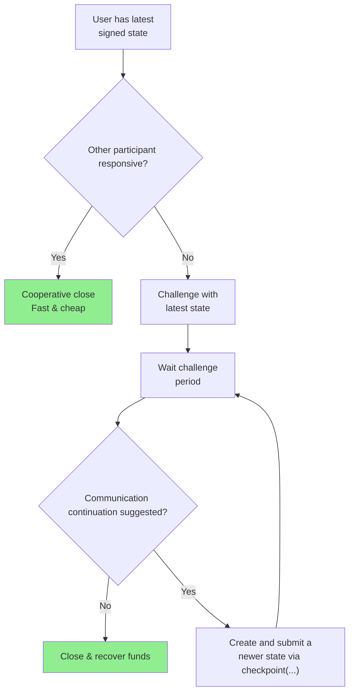
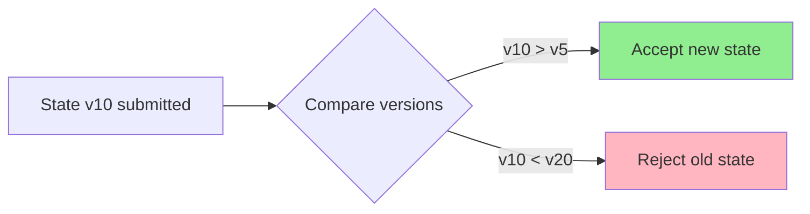

import Tooltip from '@site/src/components/Tooltip';
import { tooltipDefinitions } from '@site/src/constants/tooltipDefinitions';

# Security Considerations

## Current Limitations

The current <Tooltip content={tooltipDefinitions.custodyContract}>Custody contract</Tooltip> implementation has the following limitations:

- **Two-participant channels only**: Channels support exactly 2 <Tooltip content={tooltipDefinitions.participant}>participants</Tooltip>
- **Participant role constraint**: First participant must always be a client, while second must be a <Tooltip content={tooltipDefinitions.clearnode}>Clearnode</Tooltip>
- **Single allocation per participant**: Each participant can have only 1 allocation
- **Same-token allocations**: Both allocations must be for the same token
- **Minimum challenge duration**: Challenge duration is set to be no less than 1 hour
- **No re-challenge**: It is not possible to challenge an already challenged <Tooltip content={tooltipDefinitions.channel}>channel</Tooltip>
- **No direct EOA resize**: It is not possible to resize directly from or to your EOA; you must deposit to or withdraw funds from the Custody contract first
- **Channel required for withdrawal**: It is not possible to withdraw your funds from the <Tooltip content={tooltipDefinitions.unifiedBalance}>Unified Balance</Tooltip> on a chain with no open channel without opening a channel first. In a future major release, we plan to merge these steps in one operation
- **Separate resize and balance operations**: It is not possible to top-up a Unified Balance from or withdraw to your EOA balance in the same `resize(...)` operation. You must deposit your funds prior to or withdraw after the `resize(...)` operation. In a future major release, we plan to merge these steps in one operation

:::note Future Improvements
Many of these limitations are implementation-specific and are planned to be addressed in future major releases. They do not represent fundamental protocol constraints.
:::

## Threat Model

### Assumptions

The protocol operates under the following security assumptions:

- **At least one honest party per <Tooltip content={tooltipDefinitions.channel}>channel</Tooltip>** willing to enforce their rights
- **<Tooltip content={tooltipDefinitions.blockchain}>Blockchain</Tooltip> is secure and censorship-resistant** within reasonable bounds
- **Cryptographic primitives are secure** (ECDSA, keccak256)
- **<Tooltip content={tooltipDefinitions.participant}>Participants</Tooltip> have access to the blockchain** to submit challenges within the challenge period

:::info Trust Model
<Tooltip content={tooltipDefinitions.nitroliteProtocol}>Nitrolite</Tooltip> is designed as a **trustless protocol** - no single party can steal funds or prevent others from recovering their legitimate share.
:::

### Protected Against

The protocol provides protection against:

- **Replay attacks** via version number checking in <Tooltip content={tooltipDefinitions.custodyContract}>Custody contract</Tooltip>
- **State withholding** via challenge mechanism
- **Unauthorized state transitions** via signature verification
- **Funds theft** - all transitions require valid signatures from appropriate parties

### Not Protected Against

The protocol cannot protect against:

- **All <Tooltip content={tooltipDefinitions.participant}>participants</Tooltip> colluding** to violate application rules
- **<Tooltip content={tooltipDefinitions.blockchain}>Blockchain</Tooltip>-level attacks** (51% attacks, MEV exploitation, etc.)
- **Denial of service by blockchain congestion** - may affect ability to respond to challenges

:::warning Blockchain Dependency
The security of <Tooltip content={tooltipDefinitions.nitroliteProtocol}>Nitrolite</Tooltip> <Tooltip content={tooltipDefinitions.channel}>channels</Tooltip> depends on the underlying <Tooltip content={tooltipDefinitions.blockchain}>blockchain's</Tooltip> liveness and security. Extended blockchain downtime during a challenge period could prevent parties from responding.
:::

## Security Properties

### Funds Safety

**Property**: <Tooltip content={tooltipDefinitions.participant}>Participants</Tooltip> can always recover their funds according to the latest valid signed <Tooltip content={tooltipDefinitions.channelState}>state</Tooltip>, even if other participants become unresponsive.

**Mechanism**: The challenge-response system ensures that:
1. Any party can initiate closure unilaterally
2. Challenge period allows time for others to respond with newer states
3. Newest valid state always wins
4. Funds are distributed according to the final accepted state



### State Validity

**Property**: Only <Tooltip content={tooltipDefinitions.channelState}>states</Tooltip> signed by the required <Tooltip content={tooltipDefinitions.participant}>participants</Tooltip> (as determined by the <Tooltip content={tooltipDefinitions.adjudicator}>adjudicator</Tooltip>) can be accepted.

**Mechanism**:
- Every state update requires cryptographic signatures
- Signatures are verified against the <Tooltip content={tooltipDefinitions.packedState}>packedState</Tooltip>
- Adjudicator validates state transitions according to application rules
- Invalid states are rejected on-chain

:::success Cryptographic Security
State validity is enforced through [supported signatures](./signature-formats), all of which are supported by Ethereum itself.
:::

#### EIP-712 Signature Support

<Tooltip content={tooltipDefinitions.nitroliteProtocol}>Nitrolite</Tooltip> supports **EIP-712 (Typed Structured Data)** signatures in addition to raw ECDSA and EIP-191. This provides significant security and user experience advantages:

**Security Benefits**:
- **Domain Separation**: Signatures are bound to a specific contract and chain, preventing replay attacks across different applications or networks
- **Type Safety**: Structured data hashing ensures only valid state structures can be signed, preventing malformed data injection
- **Semantic Clarity**: Each field's type and purpose is cryptographically enforced, reducing ambiguity attacks

**User Experience Benefits**:
- **Human-Readable**: Modern wallets (MetaMask, Ledger, etc.) display EIP-712 signatures as structured fields instead of opaque hex strings
- **Transparency**: Users see exactly what `channelId`, `intent`, `version`, `allocations`, and `data` they're signing
- **Trust**: Clear presentation reduces phishing risks and increases user confidence

**Example Wallet Display**:
```
Sign Typed Data:
  channelId: 0xabcd1234...
  intent: OPERATE (1)
  version: 5
  allocations:
    [0] destination: 0x742d35Cc..., token: USDC, amount: 100.00
    [1] destination: 0x123456Cc..., token: USDC, amount: 0.00
```

Compared to EIP-191 which would show:
```
Sign Message:
0x1ec5000000000000000000000000000000000000000000000000000000001234abcd...
[500+ more hex characters]
```

**Implementation Note**: The protocol accepts **all three formats** (raw ECDSA, EIP-191, EIP-712) for maximum compatibility, but EIP-712 is **strongly recommended** for production applications due to its superior security and UX properties.

Supporting EIP-712 signatures also differentiates <Tooltip content={tooltipDefinitions.nitroliteProtocol}>Nitrolite</Tooltip> by keeping state channel operations wallet-friendly and lowering integration friction compared to protocols limited to raw message signing.

### Liveness

**Property**: As long as the <Tooltip content={tooltipDefinitions.blockchain}>blockchain</Tooltip> is live and accepts transactions within the challenge period, honest <Tooltip content={tooltipDefinitions.participant}>participants</Tooltip> can enforce their rights.

**Requirements**:
- Blockchain must be operational
- Participant must be able to submit transactions
- Challenge period must be sufficient for transaction confirmation

**Recommended Challenge Periods**:
- **High-value <Tooltip content={tooltipDefinitions.channel}>channels</Tooltip>**: 24-48 hours (default: 24 hours / 86400 seconds)
- **Medium-value channels**: 12-24 hours
- **Low-value rapid channels**: 6-12 hours

:::caution Challenge Period Trade-offs
Longer challenge periods provide more security but slower dispute resolution. Shorter periods enable faster closure but require more vigilant monitoring.
:::

### Censorship Resistance

**Property**: Since anyone can submit challenges and responses, censorship of a single <Tooltip content={tooltipDefinitions.participant}>participant</Tooltip> does not prevent <Tooltip content={tooltipDefinitions.channel}>channel</Tooltip> closure.

**Mechanism**:
- Any participant can initiate challenge
- Any participant can respond to challenge
- Multiple participants can attempt the same operation
- As long as one honest party can transact, the channel can be resolved

## Attack Vectors and Mitigations

### Replay Attacks

**Attack**: Resubmitting old signed <Tooltip content={tooltipDefinitions.channelState}>states</Tooltip> to revert <Tooltip content={tooltipDefinitions.channel}>channel</Tooltip> to a previous favorable allocation.

**Mitigation**: 
- <Tooltip content={tooltipDefinitions.adjudicator}>Adjudicators</Tooltip> MUST implement version checking to verify that a supplied "candidate" is indeed supported by a supplied "proof".
- Higher version numbers supersede lower versions
- On-chain contract tracks the highest version seen
- Old states are automatically rejected



:::tip Version Monotonicity
Always ensure state versions increase monotonically. Never sign two different states with the same version number.
:::

### State Withholding

**Attack**: Refusing to cooperate in closing <Tooltip content={tooltipDefinitions.channel}>channel</Tooltip>, holding funds hostage.

**Mitigation**: 
- Challenge mechanism allows unilateral closure
- Challenge period ensures fair dispute resolution
- Latest signed <Tooltip content={tooltipDefinitions.channelState}>state</Tooltip> always prevails

**Example Scenario**:
```
1. Alice and Bob have channel with $1000 each
2. After trading, valid state shows Alice: $1500, Bob: $500
3. Bob refuses to cooperate in cooperative close
4. Alice initiates challenge with latest signed state
5. Bob has access only to an older state, meaning he is unable to resolve the challenge
6. After challenge period elapses, Alice's state becomes the final one
7. Alice recovers her $1500
```

### Challenge Griefing

**Attack**: Repeatedly challenging with old states to delay closure and grief the counterparty.

**Mitigation**:
- Each valid newer state resets the challenge period
- Attacker must pay gas for each challenge attempt
- Eventually attacker runs out of old states
- Newest state always wins regardless of challenge count
- The party being griefed can checkpoint with the latest valid <Tooltip content={tooltipDefinitions.channelState}>state</Tooltip>, impeding the griefer from challenging with any intermediate state

:::note Economic Disincentive
Challenge griefing is economically costly for the attacker (gas fees) while only causing time delay, not fund loss, for the victim.
:::

### Front-Running

**Attack**: Observing pending challenge transaction and front-running with a newer state.

**Mitigation**: 
- **This is actually desired behavior** in Nitrolite
- The newest state should always win
- Front-running helps ensure the most recent state is used
- Both parties benefit from accurate state resolution

## Best Practices

### For Users

**Essential Practices**:

1. **Never sign duplicate versions**: Never sign two different <Tooltip content={tooltipDefinitions.channelState}>states</Tooltip> with the same version number
2. **Keep records**: Maintain a record of the latest state you've signed
3. **Monitor events**: Watch the <Tooltip content={tooltipDefinitions.blockchain}>blockchain</Tooltip> for <Tooltip content={tooltipDefinitions.channel}>channel</Tooltip> events (Challenged, Closed)
4. **Respond promptly**: React to challenges within the challenge period
5. **Verify adjudicators**: Only use <Tooltip content={tooltipDefinitions.adjudicator}>adjudicator</Tooltip> contracts from trusted sources

:::danger Critical Rule
**NEVER sign two different states with the same version number.** This creates ambiguity about the true latest state and can lead to disputes.
:::

### For Implementers

**Implementation Requirements**:

1. **Validate thoroughly**: Check all inputs before submitting transactions
2. **Use adjudicators wisely**: Leverage <Tooltip content={tooltipDefinitions.adjudicator}>adjudicators</Tooltip> to enforce application rules
3. **Set appropriate challenge periods**: Balance security needs with user experience
4. **Implement proper key management**: Secure storage for <Tooltip content={tooltipDefinitions.participant}>participant</Tooltip> private keys
5. **Log state transitions**: Maintain audit trail of all <Tooltip content={tooltipDefinitions.channelState}>state</Tooltip> updates

**Sample Validation Checklist**:

```markdown
Before submitting state on-chain:
☐ Verify all required signatures present
☐ Verify signatures are valid for expected participants
☐ Verify state version is sequential
☐ Verify allocations sum correctly
☐ Verify magic numbers (CHANOPEN/CHANCLOSE) if applicable
☐ Verify channelId matches expected value
☐ Test with small amounts first
```

### For Adjudicator Developers

**Critical Requirements**:

1. **Implement strict version comparison**: Ensure newer states always supersede older ones
2. **Validate state transitions**: Enforce application-specific rules correctly
3. **Optimize for gas efficiency**: Validation happens on-chain during disputes
4. **Consider edge cases**: Handle all possible state transition scenarios
5. **Audit thoroughly**: Security review before deployment is essential

:::warning Adjudicator Responsibility
<Tooltip content={tooltipDefinitions.adjudicator}>Adjudicators</Tooltip> are critical to <Tooltip content={tooltipDefinitions.channel}>channel</Tooltip> security. A flawed adjudicator can undermine the entire channel's safety guarantees.
:::

:::caution Before Implementing Your Own Adjudicator
The <Tooltip content={tooltipDefinitions.adjudicator}>Adjudicator</Tooltip> is an incredibly important part of the <Tooltip content={tooltipDefinitions.nitroliteProtocol}>Nitrolite</Tooltip> protocol. Yellow Network is built on top of a specific adjudicator, which if changed, will render interoperability and security guarantees impossible. Before starting to implement your own Adjudicator, please be sure to advise the Nitrolite developer team, so that your work is not left out.
:::

## Security Guarantees Summary

| Property | Guarantee | Mechanism |
|----------|-----------|-----------|
| **Funds Safety** | Cannot lose funds with valid signed state | Challenge-response + signatures |
| **State Validity** | Only properly signed states accepted | Signature verification |
| **Liveness** | Can always close if blockchain is live | Unilateral challenge mechanism |
| **Censorship Resistance** | Any party can enforce closure | Multiple submission paths |
| **No Replay** | Old states cannot be reused | Version number validation |

:::success Strong Security Model
<Tooltip content={tooltipDefinitions.nitroliteProtocol}>Nitrolite</Tooltip> provides **strong security guarantees** built on top of Layer 1 <Tooltip content={tooltipDefinitions.blockchain}>blockchain</Tooltip> security, while enabling Layer 2 scalability and efficiency.
:::

## Emergency Procedures

### If <Tooltip content={tooltipDefinitions.clearnode}>a Clearnode</Tooltip> Becomes Unresponsive

1. **Retrieve latest signed <Tooltip content={tooltipDefinitions.channelState}>state</Tooltip>** from local storage
2. **Initiate challenge** on-chain with latest state
3. **Close the <Tooltip content={tooltipDefinitions.channel}>channel</Tooltip>** after challenge period expires
4. **Funds are recovered** according to latest valid state

### If You Have Been Challenged

1. **Check for the latest <Tooltip content={tooltipDefinitions.channelState}>state</Tooltip>** - make sure the <Tooltip content={tooltipDefinitions.channel}>channel</Tooltip> was challenged with the latest state. If not, you should checkpoint it with one to avoid funds loss
2. **Ensure <Tooltip content={tooltipDefinitions.blockchain}>blockchain</Tooltip> access** - check network connectivity
3. **Use appropriate gas prices** - ensure timely confirmation
4. **Have backup RPC endpoints** - don't rely on single provider

:::tip Monitoring Best Practice
Set up automated monitoring with alerts for <Tooltip content={tooltipDefinitions.channel}>channel</Tooltip> events. This ensures you can respond quickly to challenges even if you're not actively watching.
:::
