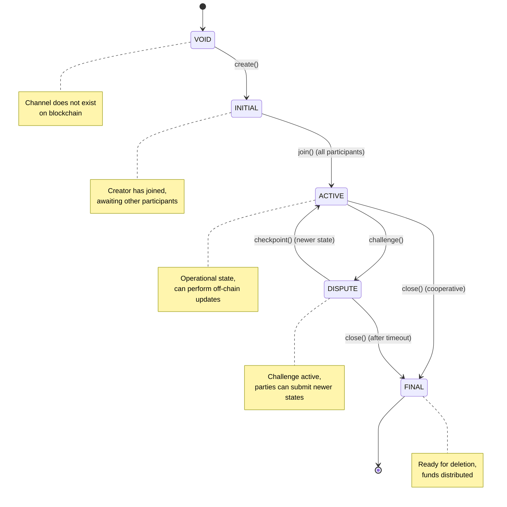

import Tooltip from '@site/src/components/Tooltip';

# Protocol Reference

Quick reference guide for protocol versions, constants, standards, and specifications.

:::info Quick Navigation
Jump to a section:
- [Protocol Versions](#protocol-versions) - Nitrolite & Nitro RPC versions
- [Magic Numbers](#magic-numbers) - CHANOPEN & CHANCLOSE
- [Participant Indices](#participant-indices) - Creator & Clearnode positions
- [Channel Status](#channel-status-state-machine) - Status transitions
- [Error Codes](#error-codes) - JSON-RPC & application errors
- [Signature Standards](#signature-standards) - On-chain & off-chain formats
- [Deployment Addresses](#deployment-addresses) - Contract locations
- [Asset Identifiers](#asset-identifiers) - Supported assets
- [EIP References](#eip-references) - Ethereum standards used
:::

---

## Protocol Versions

### Nitrolite Protocol

| Property | Value |
|----------|-------|
| **Version** | 1.0 |
| **Status** | Production |
| **Compatibility** | EVM-compatible chains |

**Supported Chains**: Ethereum, Polygon, Arbitrum One, Optimism, Base, and other EVM-compatible networks.

### Nitro RPC Protocol

| Version | Status | Features |
|---------|--------|----------|
| **0.2** | Legacy | Basic state updates only |
| **0.4** | Current | Intent system (OPERATE, DEPOSIT, WITHDRAW) |

:::tip Version Recommendation
**Always use NitroRPC/0.4** for new implementations. Version 0.4 adds the intent system for <Tooltip content="Off-chain channels built on top of payment channels, intended to be used by app developers to enable application-specific interactions and transactions without touching the blockchain">app sessions</Tooltip>, enabling dynamic fund management (deposits and withdrawals) within active sessions.
:::

**Breaking Changes**:
- NitroRPC/0.4 introduces the `intent` parameter in `submit_app_state`
- NitroRPC/0.2 sessions cannot use DEPOSIT or WITHDRAW intents
- Protocol version is set during <Tooltip content="Off-chain channels built on top of payment channels, intended to be used by app developers to enable application-specific interactions and transactions without touching the blockchain">app session</Tooltip> creation and cannot be changed

---

## Magic Numbers

Constants used in the protocol to signal special <Tooltip content="A snapshot of the channel at a point in time, including fund allocations and application-specific data">state</Tooltip> types.

### CHANOPEN

```
Value (Decimal): 7877
Value (Hex): 0x1EC5
```

**Description**: Magic number in `state.data` for <Tooltip content="A secure communication pathway between participants that locks funds in an on-chain smart contract while enabling off-chain state updates">channel</Tooltip> funding states.

**Usage**: 
- Signals this is an initial state during create/join phase
- Used in `create_channel` RPC method
- Required for `Custody.create()` on-chain transaction
- Both <Tooltip content="An entity (identified by a wallet address) that is part of a channel">participants</Tooltip> must sign state containing CHANOPEN

**Example**:
```javascript
state.data = "0x0000000000000000000000000000000000000000000000000000000000001ec5"
// Last 4 hex digits are 1EC5 (7877 in decimal)
```

### CHANCLOSE

```
Value (Decimal): 7879
Value (Hex): 0x1EC7
```

**Description**: Magic number in `state.data` for <Tooltip content="A secure communication pathway between participants that locks funds in an on-chain smart contract while enabling off-chain state updates">channel</Tooltip> closing states.

**Usage**: 
- Signals this is a final state for cooperative closure
- Used in `close_channel` RPC method
- Required for `Custody.close()` on-chain transaction
- All <Tooltip content="An entity (identified by a wallet address) that is part of a channel">participants</Tooltip> must sign state containing CHANCLOSE

**Example**:
```javascript
state.data = "0x0000000000000000000000000000000000000000000000000000000000001ec7"
// Last 4 hex digits are 1EC7 (7879 in decimal)
```

:::caution Magic Number Validation
Smart contracts validate these magic numbers to ensure proper <Tooltip content="A secure communication pathway between participants that locks funds in an on-chain smart contract while enabling off-chain state updates">channel</Tooltip> lifecycle. Using incorrect magic numbers will cause transactions to revert.
:::

---

## Participant Indices

In a standard payment <Tooltip content="A secure communication pathway between participants that locks funds in an on-chain smart contract while enabling off-chain state updates">channel</Tooltip>, <Tooltip content="An entity (identified by a wallet address) that is part of a channel">participants</Tooltip> are identified by their array index.

### Index 0: Creator (User)

**Role**: <Tooltip content="The participant at index 0 in a channel who initiates channel creation">Creator</Tooltip>

**Responsibilities**:
- Initiates <Tooltip content="A secure communication pathway between participants that locks funds in an on-chain smart contract while enabling off-chain state updates">channel</Tooltip> creation
- Typically the one depositing funds
- First to sign states (`state.sigs[0]`)
- Calls `Custody.create()` on-chain

**Example**:
```javascript
channel.participants[0] = "0x742d35Cc6634C0532925a3b844Bc9e7595f0bEb" // User
```

### Index 1: Clearnode

**Role**: Service provider

**Responsibilities**:
- Joins after creation
- Provides off-chain services (Nitro RPC, unified balance management)
- Second to sign states (`state.sigs[1]`)
- Calls `Custody.join()` on-chain

**Example**:
```javascript
channel.participants[1] = "0x123456789abcdef0123456789abcdef012345678" // Clearnode
```

:::warning Signature Order Critical
Signatures array order **MUST** match <Tooltip content="An entity (identified by a wallet address) that is part of a channel">participants</Tooltip> array order. Mismatched signatures will cause transaction failures.

```javascript
state.sigs[0] = creator_signature   // Must be from participants[0]
state.sigs[1] = clearnode_signature // Must be from participants[1]
```
:::

---

## Channel Status State Machine

<Tooltip content="A secure communication pathway between participants that locks funds in an on-chain smart contract while enabling off-chain state updates">Channel</Tooltip> lifecycle is governed by status transitions.

### Status Enumeration

```solidity
enum Status {
    VOID,      // 0: Channel does not exist
    INITIAL,   // 1: Creation in progress, awaiting all participants
    ACTIVE,    // 2: Fully funded and operational
    DISPUTE,   // 3: Challenge period active
    FINAL      // 4: Ready to be closed and deleted
}
```

### State Transition Diagram



### Valid Transitions

| From | To | Trigger | Notes |
|------|----|---------|---------| 
| `VOID` | `INITIAL` | `create()` | <Tooltip content="The participant at index 0 in a channel who initiates channel creation">Creator</Tooltip> submits first |
| `INITIAL` | `ACTIVE` | `join()` | All <Tooltip content="An entity (identified by a wallet address) that is part of a channel">participants</Tooltip> joined |
| `ACTIVE` | `DISPUTE` | `challenge()` | Dispute initiated |
| `ACTIVE` | `FINAL` | `close()` | Cooperative closure |
| `DISPUTE` | `ACTIVE` | `checkpoint()` | Newer state accepted |
| `DISPUTE` | `FINAL` | `close()` | Challenge timeout |

:::tip Quick Closure
The fastest way to close a <Tooltip content="A secure communication pathway between participants that locks funds in an on-chain smart contract while enabling off-chain state updates">channel</Tooltip> is **ACTIVE → FINAL** via cooperative `close()`. This skips the challenge period entirely.
:::

---

## Error Codes

### JSON-RPC Standard Errors

Based on [JSON-RPC 2.0 Specification](https://www.jsonrpc.org/specification).

| Code | Name | Description | When to Use |
|------|------|-------------|-------------|
| `-32700` | Parse error | Invalid JSON received | Malformed JSON in request |
| `-32600` | Invalid request | Request structure invalid | Missing required fields |
| `-32601` | Method not found | Method does not exist | Unknown RPC method |
| `-32602` | Invalid params | Invalid method parameters | Wrong parameter types |
| `-32603` | Internal error | Internal server error | <Tooltip content="A virtual ledger layer that provides a unified ledger (through Nitro RPC) and coordinates state channels (through Nitrolite), providing chain abstraction for developers and users">Clearnode</Tooltip> error |

### Application-Specific Errors (1000+)

| Code | Name | Description | Resolution |
|------|------|-------------|------------|
| `1001` | Authentication required | Operation requires authenticated session | Call `auth_request`, `auth_challenge`, `auth_verify` |
| `1002` | Insufficient balance | User doesn't have enough available funds | Deposit more or close <Tooltip content="Off-chain channels built on top of payment channels, intended to be used by app developers to enable application-specific interactions and transactions without touching the blockchain">app sessions</Tooltip> |
| `1003` | Channel not found | Specified <Tooltip content="A unique identifier for a channel, formatted as a 0x-prefixed hex string (32 bytes)">channelId</Tooltip> does not exist | Verify <Tooltip content="A unique identifier for a channel, formatted as a 0x-prefixed hex string (32 bytes)">channelId</Tooltip>, create new <Tooltip content="A secure communication pathway between participants that locks funds in an on-chain smart contract while enabling off-chain state updates">channel</Tooltip> |
| `1004` | App session not found | Specified <Tooltip content="A unique identifier for an app session, formatted as a 0x-prefixed hex string (32 bytes)">appSessionId</Tooltip> does not exist | Verify ID, create new session |
| `1005` | Quorum not met | Signatures don't meet quorum requirement | Collect more signatures |
| `1006` | Version conflict | State version doesn't match expected | Fetch current state, retry with `version + 1` |
| `1007` | Invalid allocation | Allocation sum doesn't match rules | Verify allocation math |
| `1008` | Session key allowance exceeded | Operation would exceed spending cap | Increase allowance or use main wallet |
| `1009` | Unsupported chain | Specified <Tooltip content="A blockchain network identifier (uint64)">chainId</Tooltip> not supported | Use `get_config` to see supported chains |
| `1010` | Unsupported token | Specified token not supported | Use `get_assets` to see supported tokens |

**Error Response Format**:
```javascript
{
  "id": requestId,
  "error": {
    "code": 1002,
    "message": "Insufficient balance: have 50.0 USDC, need 100.0 USDC"
  }
}
```

:::note Error Handling
Always check the `error` field in responses. Successful responses have a `res` or `result` field instead.
:::

---

## Signature Standards

### On-Chain Signatures (Solidity)

Used in smart contract transactions (`create`, `join`, `close`, `challenge`, `resize`).

**Format**: Variable-length byte arrays supporting multiple signature types (since v0.3.0)

**Structure**:
```solidity
struct State {
    // ... other fields ...
    bytes[] sigs;  // Array of signatures from participants
}
```

**Supported Types**:
- **ECDSA** (65 bytes): Standard signatures from EOA wallets
- **ERC-1271**: Smart contract wallet signatures
- **ERC-6492**: Counterfactual contract signatures (not yet deployed)

**Hash**: Raw <Tooltip content="Cryptographic hash of a channel state, used for signature verification">stateHash</Tooltip> (no EIP-191 prefix for chain-agnostic compatibility)

**Example**:
```javascript
stateHash = keccak256(abi.encode(channelId, state.intent, state.version, state.data, state.allocations))
signature = sign(stateHash, participantPrivateKey) // Raw hash, no prefix
```

### Off-Chain Signatures (Nitro RPC)

Used in RPC requests and responses over WebSocket.

**Format**: 0x-prefixed hex string (typically ECDSA from session keys)

**Typical Length**: 65 bytes for ECDSA
- `r`: 32 bytes
- `s`: 32 bytes  
- `v`: 1 byte

**Representation**: 130 hex characters + `0x` prefix

**Example**:
```javascript
signature = "0x1234567890abcdef...xyz" // 132 characters total (ECDSA)
```

**Computed Over**:
```javascript
rpcHash = keccak256(JSON.stringify(req))
signature = sign(rpcHash, sessionPrivateKey)
```

:::info Session Key Signatures
Off-chain RPC signatures are typically ECDSA from session keys (EOA wallets), but the protocol supports other signature types for future flexibility.
:::

:::caution Chain-Agnostic Signatures
On-chain signatures do NOT use EIP-191 or EIP-712 prefixes to maintain chain-agnostic compatibility. This differs from typical Ethereum signing patterns.
:::

---

## Deployment Addresses

Contract deployment addresses are stored in the repository.

### Repository Structure

```
/contract/deployments/{chain_id}/{contract_name}/
├── address.txt       # Contract address
├── receipt.json      # Deployment receipt
└── metadata.json     # Contract metadata
```

**Example Path** (Polygon USDC <Tooltip content="The main on-chain contract implementing channel creation, joining, closure, and resizing. It is an implementation of the Nitrolite protocol">Custody</Tooltip>):
```
/contract/deployments/137/USDCCustody/address.txt
```

### Supported Chains

| Chain | Chain ID | Name | Status |
|-------|----------|------|--------|
| Ethereum Mainnet | `1` | ethereum | Production |
| Polygon | `137` | polygon | Production |
| Arbitrum One | `42161` | arbitrum | Production |
| Optimism | `10` | optimism | Production |
| Base | `8453` | base | Production |
| Ethereum Sepolia | `11155111` | sepolia | Testnet |
| Polygon Mumbai | `80001` | mumbai | Testnet (deprecated) |
| Polygon Amoy | `80002` | amoy | Testnet |

:::tip Finding Addresses
Use `get_config` RPC method to retrieve supported chains and contract addresses dynamically. This ensures you always have the latest deployment information.
:::

---

## Asset Identifiers

Common asset identifiers in the protocol (lowercase, consistent across chains).

### Supported Assets

| Identifier | Full Name | Decimals | Type |
|------------|-----------|----------|------|
| `"usdc"` | USD Coin | 6 | Stablecoin |
| `"usdt"` | Tether USD | 6 | Stablecoin |
| `"dai"` | Dai Stablecoin | 18 | Stablecoin |
| `"eth"` | Ethereum | 18 | Native/Wrapped |
| `"weth"` | Wrapped Ethereum | 18 | Wrapped Native |
| `"wbtc"` | Wrapped Bitcoin | 8 | Wrapped BTC |

**Usage in Methods**:
```javascript
// Always use lowercase identifier
transfer({
  allocations: [
    {"asset": "usdc", "amount": "100.0"},  // ✓ Correct
    {"asset": "USDC", "amount": "100.0"}   // ✗ Wrong
  ]
})
```

**Asset Configuration**:
```javascript
// Each asset has different contract addresses per chain
get_assets() → {
  "usdc": {
    "symbol": "usdc",
    "name": "USD Coin",
    "decimals": 6,
    "chains": [
      {"chain_id": 1, "token_address": "0xA0b86991..."},
      {"chain_id": 137, "token_address": "0x2791Bca1..."},
      {"chain_id": 42161, "token_address": "0xaf88d065..."}
    ]
  }
}
```

:::tip Asset Discovery
Use `get_assets` RPC method to retrieve the complete list of supported assets with contract addresses for each <Tooltip content="A blockchain network identifier (uint64)">chain</Tooltip>. Asset support may vary by clearnode.
:::

---

## EIP References

Ethereum Improvement Proposals referenced or used by the protocol.

### EIP-191: Signed Data Standard

**Status**: Not used in on-chain signatures (chain-agnostic design)  
**Link**: https://eips.ethereum.org/EIPS/eip-191

**Why not used**: Nitrolite signatures are computed over raw <Tooltip content="Cryptographic hash of a channel state, used for signature verification">stateHash</Tooltip> without EIP-191 prefix to maintain compatibility across different EVM chains and potential non-EVM implementations.

### EIP-712: Typed Structured Data Hashing

**Status**: Not currently used  
**Link**: https://eips.ethereum.org/EIPS/eip-712

**Future consideration**: May be adopted for improved wallet UX in future versions.

### EIP-1271: Contract Signature Validation

**Status**: Supported by <Tooltip content="A smart contract that validates state transitions according to application-specific rules">adjudicators</Tooltip>  
**Link**: https://eips.ethereum.org/EIPS/eip-1271

**Usage**: Enables smart contract wallets to sign <Tooltip content="A snapshot of the channel at a point in time, including fund allocations and application-specific data">state</Tooltip> updates as <Tooltip content="An entity (identified by a wallet address) that is part of a channel">participants</Tooltip>.

### EIP-20 (ERC-20): Token Standard

**Status**: Required for all assets  
**Link**: https://eips.ethereum.org/EIPS/eip-20

**Usage**: All assets must be ERC-20 compliant tokens. The <Tooltip content="The main on-chain contract implementing channel creation, joining, closure, and resizing. It is an implementation of the Nitrolite protocol">Custody Contract</Tooltip> uses `transferFrom` and `transfer` methods.

:::note Standards Compliance
While the protocol references these EIPs, implementation details may vary. Always consult the specific smart contract code for authoritative behavior.
:::

---

## Protocol Constants

### Time Constants

```javascript
DEFAULT_CHALLENGE_PERIOD = 86400  // 24 hours in seconds
RECOMMENDED_MIN_CHALLENGE = 3600  // 1 hour minimum
RECOMMENDED_MAX_CHALLENGE = 604800  // 7 days maximum
```

### Index Constants

```javascript
CLIENT_IDX = 0       // Client/Creator participant index
SERVER_IDX = 1       // Server/Clearnode participant index
PART_NUM = 2         // Number of participants (always 2)
CLEARNODE_INDEX = 1  // Clearnode's participant index in payment channels
```

### Version Constants

```javascript
NITROLITE_VERSION = "1.0"
NITRO_RPC_LEGACY = "NitroRPC/0.2"
NITRO_RPC_CURRENT = "NitroRPC/0.4"
```

---

## Next Steps

Now that you have the complete protocol reference:

1. **Terminology**: Review [Terminology](../protocol/terminology) for all term definitions
2. **Communication Flows**: See [Communication Flows](./communication-flows) for sequence diagrams
3. **Implementation Guide**: Follow [Implementation Checklist](./implementation-checklist) to build compliant clients
4. **Quick Start**: Use [Quick Start Guide](./quick-start) to begin development

:::tip Reference Updates
This reference reflects protocol version 1.0. For the latest updates, check the [Nitrolite repository](https://github.com/layer-3/nitrolite) or use `get_config` to query clearnode capabilities dynamically.
:::

