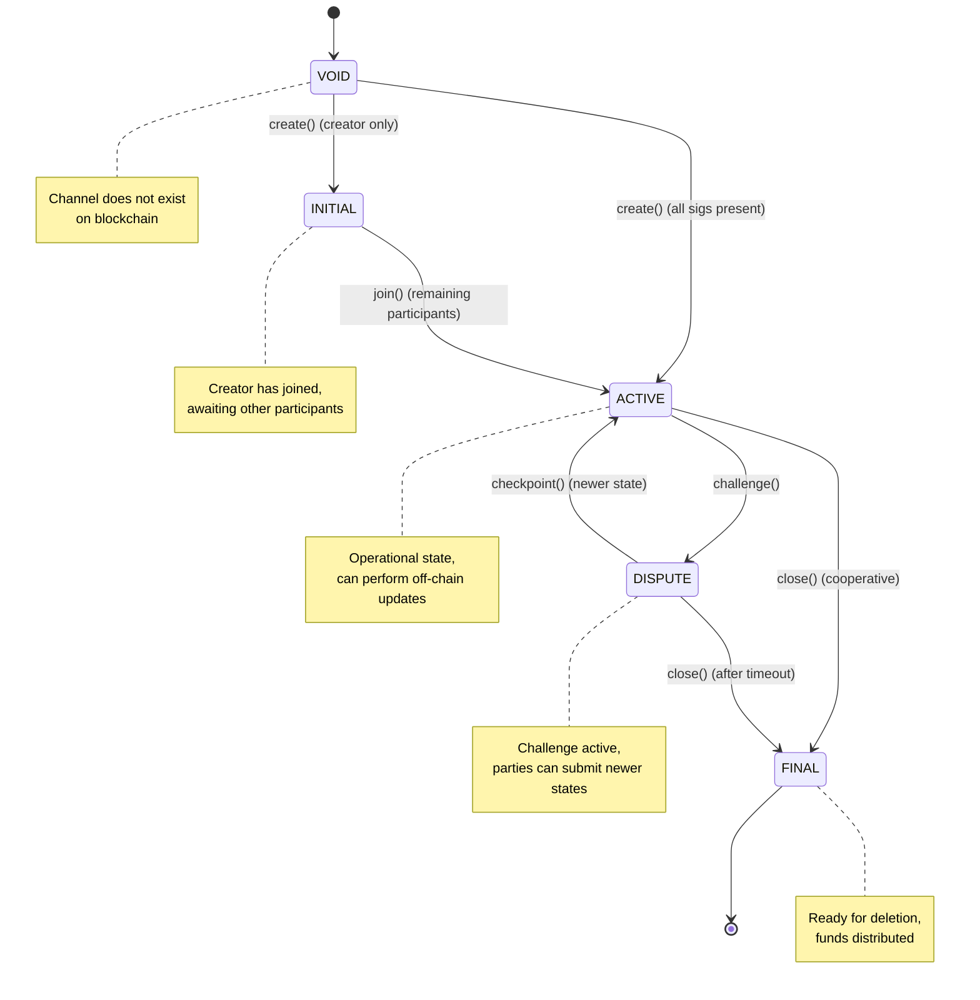

import Tooltip from '@site/src/components/Tooltip';
import { tooltipDefinitions } from '@site/src/constants/tooltipDefinitions';

# Protocol Reference

Quick reference guide for protocol versions, constants, standards, and specifications.

:::info Quick Navigation
Jump to a section:
- [Protocol Versions](#protocol-versions) - Nitrolite & Nitro RPC versions
- [State Intent System](#state-intent-system) - Channel state classification
- [Participant Indices](#participant-indices) - Creator & Clearnode positions
- [Channel Status](#channel-status-state-machine) - Status transitions
- [Signature Standards](#signature-standards) - On-chain & off-chain formats
- [EIP References](#eip-references) - Ethereum standards used
- [Protocol Constants](#protocol-constants) - Core constants
:::

---

## Protocol Versions

### Nitrolite Protocol

| Property | Value |
|----------|-------|
| **Version** | 0.5.0 |
| **Status** | Mainnet deployments live; not production yet |
| **Compatibility** | EVM-compatible chains |

**Supported Chains**: Ethereum, Polygon, Arbitrum One, Optimism, Base, and other EVM-compatible networks.

### Nitro RPC Protocol

| Version | Status | Features |
|---------|--------|----------|
| **0.2** | Legacy | Basic state updates only |
| **0.4** | Current | Intent system (OPERATE, DEPOSIT, WITHDRAW) |

:::tip Version Recommendation
**Always use NitroRPC/0.4** for new implementations. Version 0.4 adds the intent system for <Tooltip content={tooltipDefinitions.appChannel}>app sessions</Tooltip>, enabling dynamic fund management (deposits and withdrawals) within active sessions.
:::

**Breaking Changes**:
- NitroRPC/0.4 introduces the `intent` parameter in `submit_app_state`
- NitroRPC/0.2 sessions cannot use DEPOSIT or WITHDRAW intents
- Protocol version is set during <Tooltip content={tooltipDefinitions.appChannel}>app session</Tooltip> creation and cannot be changed

---

## State Intent System

Channel states are classified by `state.intent` (uint8) to signal their purpose. The Solidity enum defines:

### StateIntent Enumeration

```solidity
enum StateIntent {
    OPERATE,     // 0: Normal updates (challenge/checkpoint)
    INITIALIZE,  // 1: Channel funding/creation
    RESIZE,      // 2: In-place capacity change
    FINALIZE     // 3: Cooperative closure
}
```

### Intent Usage

| Intent | Value | When Used | Method |
|--------|-------|-----------|---------|
| `INITIALIZE` | 1 | Channel creation | `Custody.create()` |
| `RESIZE` | 2 | Channel resize | `Custody.resize()` |
| `FINALIZE` | 3 | Cooperative closure | `Custody.close()` |
| `OPERATE` | 0 | Challenge/checkpoint | `Custody.challenge()`, `Custody.checkpoint()` |

**Example**:
```javascript
// Creation state
state.intent = 1  // INITIALIZE
state.version = 0
state.data = "0x"  // Empty for basic channels

// Closing state
state.intent = 3  // FINALIZE
state.version = currentVersion + 1
state.data = "0x"
```

:::caution Intent Validation
Smart contracts validate the `intent` field to ensure proper <Tooltip content={tooltipDefinitions.channel}>channel</Tooltip> lifecycle. Incorrect intent values will cause transactions to revert.
:::

---

## Participant Indices

In a standard payment <Tooltip content={tooltipDefinitions.channel}>channel</Tooltip>, <Tooltip content={tooltipDefinitions.participant}>participants</Tooltip> are identified by their array index.

### Index 0: Creator (User)

**Role**: <Tooltip content={tooltipDefinitions.creatorParticipant}>Creator</Tooltip>

**Responsibilities**:
- Initiates <Tooltip content={tooltipDefinitions.channel}>channel</Tooltip> creation
- Typically the one depositing funds
- First to sign states (`state.sigs[0]`)
- Calls `Custody.create()` on-chain

**Example**:
```javascript
channel.participants[0] = "0x742d35Cc6634C0532925a3b844Bc9e7595f0bEb" // User
```

### Index 1: Clearnode

**Role**: Service provider

**Responsibilities**:
- Co-signs the initial state before on-chain `create()`; there is no separate `join()` call
- Provides off-chain services (Nitro RPC, unified balance management)
- Second to sign states (`state.sigs[1]`)

**Example**:
```javascript
channel.participants[1] = "0x123456789abcdef0123456789abcdef012345678" // Clearnode
```

:::warning Signature Order Critical
Signatures array order **MUST** match <Tooltip content={tooltipDefinitions.participant}>participants</Tooltip> array order. Mismatched signatures will cause transaction failures.

```javascript
state.sigs[0] = creator_signature   // Must be from participants[0]
state.sigs[1] = clearnode_signature // Must be from participants[1]
```
:::

---

## Channel Status State Machine

<Tooltip content={tooltipDefinitions.channel}>Channel</Tooltip> lifecycle is governed by status transitions.

### Status Enumeration

```solidity
enum Status {
    VOID,      // 0: Channel does not exist
    INITIAL,   // 1: Creation in progress, awaiting all participants
    ACTIVE,    // 2: Fully funded and operational
    DISPUTE,   // 3: Challenge period active
    FINAL      // 4: Ready to be closed and deleted
}
```

### State Transition Diagram



### Valid Transitions

| From | To | Trigger | Notes |
|------|----|---------|---------| 
| `VOID` | `INITIAL` | `create()` (creator only) | Legacy flow; awaiting other participants |
| `VOID` | `ACTIVE` | `create()` (all sigs present) | Current flow; both participants co-sign initial state |
| `INITIAL` | `ACTIVE` | `join()` | Remaining <Tooltip content={tooltipDefinitions.participant}>participants</Tooltip> join |
| `ACTIVE` | `DISPUTE` | `challenge()` | Dispute initiated |
| `ACTIVE` | `FINAL` | `close()` | Cooperative closure |
| `DISPUTE` | `ACTIVE` | `checkpoint()` | Newer state accepted |
| `DISPUTE` | `FINAL` | `close()` | Challenge timeout |

:::tip Quick Closure
The fastest way to close a <Tooltip content={tooltipDefinitions.channel}>channel</Tooltip> is **ACTIVE → FINAL** via cooperative `close()`. This skips the challenge period entirely.
:::

---

## Signature Standards

### On-Chain Signatures (Solidity)

Used in smart contract transactions (`create`, `join`, `close`, `challenge`, `resize`).

**Format**: Variable-length byte arrays supporting multiple signature types (since v0.3.0)

**Structure**:
```solidity
struct State {
    // ... other fields ...
    bytes[] sigs;  // Array of signatures from participants
}
```

**Supported Types**:
- **ECDSA** (65 bytes): Standard signatures from EOA wallets
- **ERC-1271**: Smart contract wallet signatures
- **ERC-6492**: Counterfactual contract signatures (not yet deployed)

**Hash**: Raw `packedState` (no EIP-191 prefix for chain-agnostic compatibility)

**Example**:
```javascript
packedState = keccak256(abi.encode(channelId, state.intent, state.version, state.data, state.allocations))
signature = sign(packedState, participantPrivateKey) // Raw hash, no prefix
```

### Off-Chain Signatures (Nitro RPC)

Used in RPC requests and responses over RPC.

**Format**: 0x-prefixed hex string (typically ECDSA from session keys)

**Typical Length**: 65 bytes for ECDSA
- `r`: 32 bytes
- `s`: 32 bytes  
- `v`: 1 byte

**Representation**: 130 hex characters + `0x` prefix

**Example**:
```javascript
signature = "0x1234567890abcdef...xyz" // 132 characters total (ECDSA)
```

**Computed Over**:
```javascript
rpcHash = keccak256(JSON.stringify(req))
signature = sign(rpcHash, sessionPrivateKey)
```

:::info Session Key Signatures
Off-chain RPC signatures are typically ECDSA from session keys (EOA wallets), but the protocol supports other signature types for future flexibility.
:::

:::caution Chain-Agnostic Signatures
On-chain signatures do NOT use EIP-191 or EIP-712 prefixes to maintain chain-agnostic compatibility. This differs from typical Ethereum signing patterns. Off-chain RPC signatures (e.g., authentication) DO use EIP-712 for better wallet UX.
:::

---

## EIP References

Ethereum Improvement Proposals referenced or used by the protocol.

### EIP-191: Signed Data Standard

**Status**: Not used in on-chain signatures (chain-agnostic design)  
**Link**: https://eips.ethereum.org/EIPS/eip-191

**Why not used for on-chain**: On-chain signatures are computed over raw `packedState` hash without EIP-191 prefix to maintain compatibility across different EVM chains and potential non-EVM implementations.

### EIP-712: Typed Structured Data Hashing

**Status**: Used for off-chain RPC authentication  
**Link**: https://eips.ethereum.org/EIPS/eip-712

**Usage**: Authentication flow uses EIP-712 typed data for signing the Policy structure (challenge, wallet, session_key, expires_at, scope, allowances) with the main wallet. This provides better wallet UX by displaying human-readable signing data.

### EIP-1271: Contract Signature Validation

**Status**: Supported by <Tooltip content={tooltipDefinitions.adjudicator}>adjudicators</Tooltip>  
**Link**: https://eips.ethereum.org/EIPS/eip-1271

**Usage**: Enables smart contract wallets to sign <Tooltip content={tooltipDefinitions.channelState}>state</Tooltip> updates as <Tooltip content={tooltipDefinitions.participant}>participants</Tooltip>.

### EIP-20 (ERC-20): Token Standard

**Status**: Required for all assets  
**Link**: https://eips.ethereum.org/EIPS/eip-20

**Usage**: All assets must be ERC-20 compliant tokens. The <Tooltip content={tooltipDefinitions.custodyContract}>Custody Contract</Tooltip> uses `transferFrom` and `transfer` methods.

:::note Standards Compliance
While the protocol references these EIPs, implementation details may vary. Always consult the specific smart contract code for authoritative behavior.
:::

---

## Protocol Constants

The only protocol-wide constants defined in code are:

```solidity
uint256 constant PART_NUM   = 2; // Channels are always 2-party
uint256 constant CLIENT_IDX = 0; // Client/creator participant index
uint256 constant SERVER_IDX = 1; // Server/clearnode participant index
```

All channel arrays (participants, allocations, sigs) and state validation logic rely on these indices and fixed participant count.

---

## Next Steps

Now that you have the complete protocol reference:

1. **Terminology**: Review [Terminology](./terminology) for all term definitions
2. **Communication Flows**: See [Communication Flows](./communication-flows) for sequence diagrams
3. **Implementation Guide**: Follow [Implementation Checklist](./implementation-checklist) to build compliant clients
4. **Channel Lifecycle**: See [Channel Lifecycle](../on-chain/channel-lifecycle) for detailed state transitions

:::tip Reference Updates
This reference reflects protocol version 0.5.0. For the latest updates, check the [Nitrolite repository](https://github.com/layer-3/nitrolite) or use `get_config` to query clearnode capabilities dynamically.
:::
