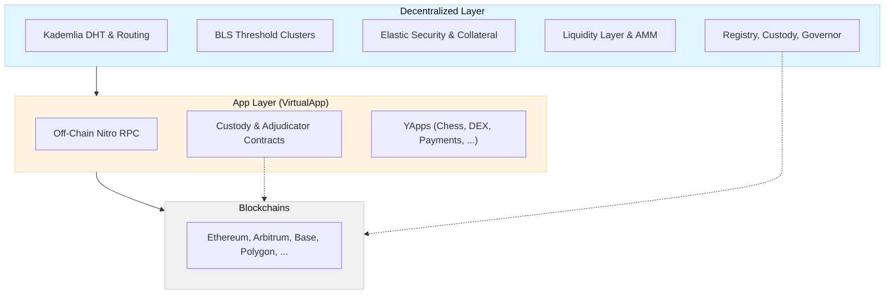

import Tooltip from '@site/src/components/Tooltip';
import { tooltipDefinitions } from '@site/src/constants/tooltipDefinitions';

# Introduction

## What is Yellow Protocol?

Yellow Protocol is a layered system for decentralized clearing, settlement, and application hosting across multiple blockchains. It is developed and maintained by Layer3 Fintech Ltd. and operated by independent node operators running open-source <Tooltip content={tooltipDefinitions.clearnode}>clearnode</Tooltip> software.

The protocol is composed of two distinct layers:

1. **Decentralized Layer** — A peer-to-peer overlay network (the Yellow Network Protocol, or YNP) that uses a Kademlia DHT, BLS threshold signatures, and elastic security to manage accounts, route transactions, and settle assets across chains.

2. **App Layer (VirtualApp)** — A <Tooltip content={tooltipDefinitions.channel}>state channel</Tooltip> protocol (also known as YApps) that enables off-chain interactions between <Tooltip content={tooltipDefinitions.participant}>participants</Tooltip> with minimal on-chain operations. It forms a unified virtual ledger for applications to escrow funds while being fully abstracted from the underlying blockchain.

:::info On-Chain Contracts
Both layers currently deploy their own on-chain smart contracts. These are expected to be merged into a unified contract suite once testnet concludes.
:::

## Design Goals

- **Scalability**: Move high-frequency operations off-chain; throughput scales with the number of users
- **Cost Efficiency**: Minimize gas fees by reducing on-chain transactions to deposits, withdrawals, and disputes
- **Security**: Value-proportional security — the cost to corrupt a cluster always exceeds the value it protects
- **Interoperability**: Support multiple blockchains and assets through a unified clearing layer
- **Developer Experience**: Provide clear, implementable specifications for both layers

## Specification Scope

This documentation defines the Yellow Protocol in a **programming language-agnostic manner**. Implementers can use these specifications to build compliant implementations in any language (Go, Python, Rust, JavaScript, etc.).

| Section | Layer | Covers |
|---------|-------|--------|
| Decentralized Layer | Network | DHT topology, cluster lifecycle, elastic security, protocol lifecycle, liquidity, security analysis (available in v1.x) |
| [App Layer — On-Chain](./app-layer/on-chain/overview) | VirtualApp | Smart contracts for fund custody, dispute resolution, and settlement |
| [App Layer — Off-Chain](./app-layer/off-chain/overview) | VirtualApp | Nitro RPC protocol for state channel operations, transfers, and app sessions |

:::caution Language Independence
Implementation-specific details are referenced but not mandated by this specification. The protocol description is abstract and can be implemented in any programming language.
:::

## RFC 2119 Keywords

The keywords "MUST", "MUST NOT", "REQUIRED", "SHALL", "SHALL NOT", "SHOULD", "SHOULD NOT", "RECOMMENDED", "MAY", and "OPTIONAL" in this document are to be interpreted as described in RFC 2119.
