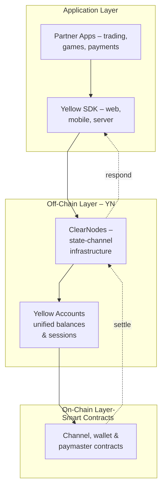
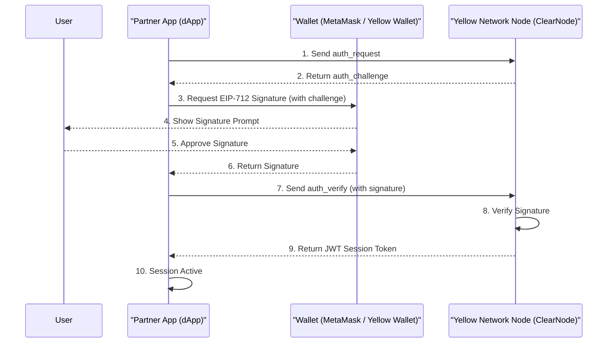

# Yellow Ecosystem: Architectural Overview

## Yellow Ecosystem

Yellow delivers Web2-grade speed for Web3 apps (subject to network latency) by moving frequent actions off-chain into dispute-ready state channels, while keeping funds self-custodied on-chain. Builders get one SDK and a single RPC surface across EVMs; users get instant interactions with no gas prompts for in-app actions and a unified balance.

Our ecosystem is built on three core components:

1. **Yellow Network (Infrastructure):** This is the proprietary, high-performance **state-channel network** that acts as the ecosystem's engine. It enables instant, off-chain interactions with no gas prompts for in-app actions.
2. **Yellow Account (User Hub):** This is the user's primary, off-chain account *on* Yellow Network. It provides a **unified, chain-agnostic balance** and is used for all in-app activities (trading, swaps, micropayments, etc.).
3. **On-Chain Wallets (Gateway):** This category includes both the user's **Yellow Wallet** and any **External Wallet (EOA)** (like MetaMask). Their identical role is to act as the secure gateway to their Yellow Account. This is the perfect solution for:
    - **Existing Web3 Users** who want to deposit funds directly from their existing wallets (e.g., MetaMask).
    - **New Web2 Users** who need an easy entry point to the ecosystem (Yellow Wallet).
### Visual Overview: Yellow Ecosystem Architecture

This architecture provides the best of both worlds: instant interactions with no gas prompts for in-app actions via the off-chain **Yellow Account** for daily use, and the security and self-custody of on-chain wallets for managing funds. Gas appears only for channel operations.

---

## Yellow Network & Yellow Account

Yellow Network is the high-speed infrastructure, and Yellow Account is the user's personal account on that network. This combination unlocks a "Web2-like" user experience with the full power of Web3.

For complete documentation, please visit: [**https://docs.yellow.org/**](https://docs.yellow.org/)

### Core Capabilities

- **Instant interactions:** Millisecond-level UX (subject to network latency) with no gas prompts for in-app actions.
- **Single RPC across EVMs:** Hit any EVM from one surface; no network switching.
- **One sign-in:** Authenticate once; no wallet popups during use.
- **One SDK:** Unified toolkit for web, mobile, and server.
- **Dispute-ready channels:** Auditable off-chain state secured by on-chain enforcement.

### What You Can Build on Yellow Network

- **Micropayment apps:** Pay-per-API call, no credit cards required.
- **High-frequency trading UX:** Millisecond-level matching.
- **Creator tipping:** 1-click pay-per-post and live streams.
- **Real-time multiplayer:** Fast matches with no gas prompts for in-app actions, provable payouts.

### Core Technology

- **Framework:** **ERC-7824 Nitrolite (State Channels)**
- **GitHub:** `https://github.com/erc7824/nitrolite`

---

## On-Chain vs. Off-Chain: Where Transactions Happen

We separate high-cost, low-frequency **on-chain transactions** from high-speed, zero-cost **off-chain interactions**.

| **On-Chain (Slow, Secure)**                                | **Off-Chain (Fast, Web2-like)**                                            |
| ---------------------------------------------------------- | -------------------------------------------------------------------------- |
| **Create Channel** — Open a new channel contract on-chain. | **Trade** — Execute instant swaps or exchanges.                            |
| **Deposit** — Add funds to the channel.                    | **Tip Creator** — Send small, instant tips in apps.                        |
| **Checkpoint** — Record off-chain state on-chain.          | **Play Game Round** — Pay entry fees and receive rewards instantly.        |
| **Challenge** — Start a dispute for fraudulent state.      | **Swap Tokens** — Move assets across supported tokens with no gas prompts. |
| **Withdraw** — Close the channel and settle balances.      | **Real-time Micropayments** — Stream small-value payments continuously.    |

### On-Chain Channel Management Operations

These are the only times a user interacts with the blockchain and pays a gas fee **(which can be sponsored, or the user can pay via Paymaster in any other asset, only for Yellow Wallet)**. The user's **Yellow Wallet or External Wallet handles** these transactions to manage the state channel's funds.

- **Create Channel:** A one-time on-chain transaction to create the channel on the smart contract between participants.
- **Deposit:** An on-chain transaction to add funds to the channel (e.g., funding their Yellow Account).
- **Resize:** An on-chain operation to add or withdraw assets from an active channel.
- **Checkpoint:** An on-chain transaction to submit the current off-chain state to the blockchain, creating a new "save point."
- **Challenge:** An on-chain transaction used during the dispute process to challenge a fraudulent state.
- **Withdraw:** An on-chain transaction to "cash out" and settle the final balance back to the user's wallet.

### Off-Chain Interactions (In-Ecosystem)

These actions happen **exclusively on Yellow Network** via their **Yellow Account**. They are **instant** and have **no gas prompts for in-app actions**; gas appears only for channel operations.

- Trading
- Tipping a creator.
- In-app swaps.
- Making a micropayment service.
- All real-time actions in a game (e.g., paying an entry fee, receiving a prize).
- Any interaction with an app in the Yellow App Store.

---

## On-Chain Wallets (Yellow Wallet / EOA): Secure Fund Manager

Yellow Wallet is a sophisticated, self-custodial on-chain wallet that securely holds user assets on the network and funds Yellow Account.

*This wallet has the **same architectural role as any external wallet,** like MetaMask.*

Yellow Wallet is also the perfect entry point for Web2 users, as it features a built-in **fiat on-ramp** (provider **Coinbase**) to purchase crypto easily.

### Core Technology

**Reference implementation (pluggable):** ERC-4337 (Kernel v2.6), auth via Privy, bundling via ZeroDev.

### Supported Networks

Yellow Wallet is multi-chain and fully supports **Base**, alongside Ethereum, Polygon, and other EVM networks.

---

## Authentication & Session Management

This is achieved by having the user's main wallet (e.g., MetaMask or Yellow Wallet) sign a challenge (EIP-712) provided by the network. This proves ownership and allows **ClearNode** to issue a **JWT Session Token**.

### Session Key Registration Flow

---

## Architectural Feature Comparison

| **Feature / Metric** | **On-Chain Wallets (Yellow Wallet / MetaMask)** | **Yellow Account (on Yellow Network)** |
| --- | --- | --- |
| **Core Technology** | ERC-4337 Account Abstraction / EOA | **ERC-7824 State Channels (Nitrolite)** |
| **What it's for** | On-chain asset storage, **Deposit to / Withdraw from** Yellow Account. | **Instant, off-chain, in-app interactions** (trading, swaps, rewards). |
| **User Balance** | Fragmented across multiple chains (Base, Polygon, etc.). | **Unified, chain-agnostic virtual balance.** |
| **Latency** | Dependent on L1/L2 block time (seconds to minutes). | **Millisecond-level off-chain interactions (subject to network latency).** |
| **User-visible cost** | L1/L2 gas fees required for every transaction. | **Near-zero cost for all off-chain interactions.** |
| **UX surface** | Requires network switching, gas management, pop-ups. | **Seamless "Web2-like" experience.** No pop-ups, no gas, no networks. |